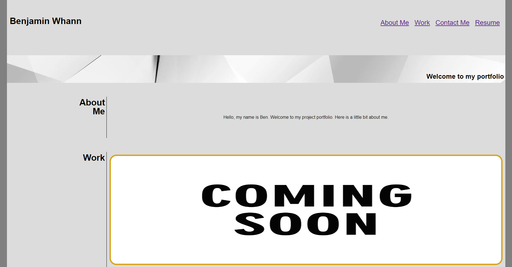

# <Project-Portfolio>

## Description

I created this webpage to serve as a portfolio to display all my future work. This will give me a convinient and stylish 
way to present my work, and hopefully it will look good to employers. I now have a much deeper understanding of HTML and CSS from working 
on this project, particularly when it comes to working with flex boxes and pseudo-selectors within CSS.

## Installation

All you need to do is pull the code down from the repository, open it in your IDE of choice, and run it in a browser.

## Usage

The page is just meant to display my work. The only functionality within the webpage are the links to my projects/contact-info/socials.

## Credits

I learned pretty much everything from the head instructor and the TA's from the bootcamp I am 
currently enrolled in. I used two images from the internet in this project, the links are listed below.

Link 1: https://wallpaperaccess.com/full/1159274.jpg

Link 2: https://earlsribpalace.com/wp-content/uploads/2019/07/coming-soon-store-placeholder-image.gif

## License

MIT License

Copyright (c) [year] [fullname]

Permission is hereby granted, free of charge, to any person obtaining a copy
of this software and associated documentation files (the "Software"), to deal
in the Software without restriction, including without limitation the rights
to use, copy, modify, merge, publish, distribute, sublicense, and/or sell
copies of the Software, and to permit persons to whom the Software is
furnished to do so, subject to the following conditions:

The above copyright notice and this permission notice shall be included in all
copies or substantial portions of the Software.

THE SOFTWARE IS PROVIDED "AS IS", WITHOUT WARRANTY OF ANY KIND, EXPRESS OR
IMPLIED, INCLUDING BUT NOT LIMITED TO THE WARRANTIES OF MERCHANTABILITY,
FITNESS FOR A PARTICULAR PURPOSE AND NONINFRINGEMENT. IN NO EVENT SHALL THE
AUTHORS OR COPYRIGHT HOLDERS BE LIABLE FOR ANY CLAIM, DAMAGES OR OTHER
LIABILITY, WHETHER IN AN ACTION OF CONTRACT, TORT OR OTHERWISE, ARISING FROM,
OUT OF OR IN CONNECTION WITH THE SOFTWARE OR THE USE OR OTHER DEALINGS IN THE
SOFTWARE.

